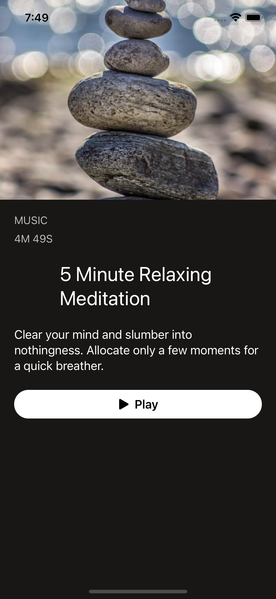

# AVKit Audio App

A SwiftUI demo project.

<table>
<thead>
   <tr>
        <th colspan="2">
Screenshots
</th>
  </tr>
</thead>
<tbody>
  <tr>
        <td>
          
        </td>
        <td>
          
        </td>
  </tr>
  <tr> 
     <th colspan="2">
     

        <b>Demo</b>

</th>
  </tr>
  <tr>
     <td colspan="3">  </td>
  </tr>
</tbody>
</table>
